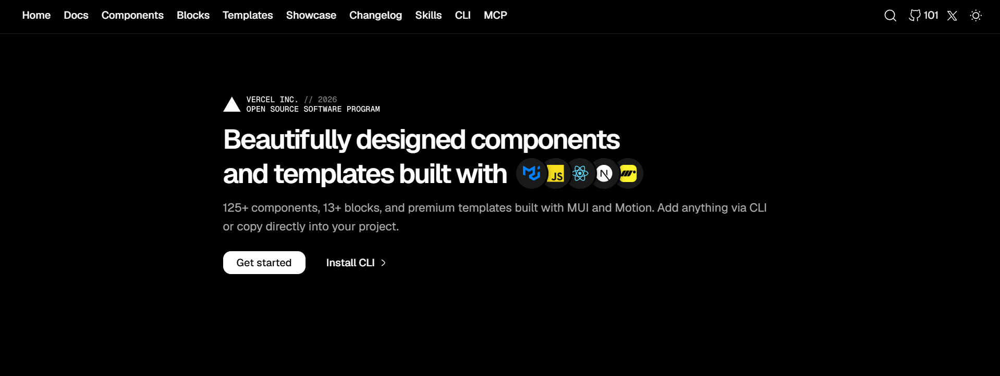

<p align="center">
  
</p>

<br />

<p align="center">
  <a href="https://vercel.com/open-source-program"></a>
</p>

<br />

<p align="center">
  Free React UI library with 125+ components, 13+ blocks, and 3 premium templates. Built with MUI and Motion.
  <br />
  <br />
  <a href="https://github.com/AbhiVarde/syncui/stargazers"><picture><source media="(prefers-color-scheme: dark)" srcset="https://www.shieldcn.dev/github/stars/AbhiVarde/syncui.svg?variant=secondary&size=xs&mode=dark&font=geist" /></picture></a>
  <a href="https://github.com/AbhiVarde/syncui/blob/main/LICENSE.md"><picture><source media="(prefers-color-scheme: dark)" srcset="https://www.shieldcn.dev/github/license/AbhiVarde/syncui.svg?variant=ghost&size=xs&mode=dark&font=geist" /></picture></a>
  <a href="https://x.com/syncuidesign"><picture><source media="(prefers-color-scheme: dark)" srcset="https://www.shieldcn.dev/x/follow/syncuidesign.svg?variant=branded&size=xs&mode=dark&font=geist" /></picture></a>
  <a href="https://vercel.com/oss"></a>
</p>

<p align="center">
  <a href="https://syncui.design">Website</a> ·
  <a href="https://syncui.design/docs">Docs</a> ·
  <a href="https://syncui.design/components">Components</a> ·
  <a href="https://syncui.design/blocks">Blocks</a> ·
  <a href="https://syncui.design/templates">Templates</a> ·
  <a href="https://syncui.design/showcase">Showcase</a> ·
  <a href="https://www.npmjs.com/package/@abhivarde/syncui">npm</a>
</p>

## CLI

Add any component or block directly into your project:

```bash
npx @abhivarde/syncui@latest add name/variant
```

Use `name/variant` to target exactly what you need, e.g. `accordion/brutalist` or `hero/centered`.

## MCP

Let your AI agent add components directly without any commands:

```json
{
  "mcpServers": {
    "syncui": {
      "command": "npx",
      "args": ["-y", "@abhivarde/syncui-mcp"]
    }
  }
}
```

Add to your MCP client config (Claude Code, Cursor, Windsurf, Codex, OpenCode).

## Registry

Components are served from a hosted registry. Fetch any component directly:

```
https://syncui.design/r/index.json
https://syncui.design/r/{name}.json
```

This is what the CLI and MCP use under the hood. New components are available the moment the site deploys — no package update needed.

## Agent Skill

Use Sync UI inside Cursor, Claude Code, Copilot, Windsurf, and more:

```bash
npx skills add AbhiVarde/syncui
```

Your AI coding tool will know every component, variant, and animation pattern without you explaining anything.

## What's Inside

| Count               | Includes                                                                                                             |
| ------------------- | -------------------------------------------------------------------------------------------------------------------- |
| **125+ Components** | Buttons, Cards, Tables, Forms, Date Pickers, Loaders, Avatars, Accordions, Carousels, Dialogs, Docks, Tabs, and more |
| **13+ Blocks**      | Hero, CTA, Pricing, and Stats sections for landing pages                                                             |
| **3 Templates**     | Startup ($29), SaaS ($29), Portfolio ($29), Bundle — all three ($79)                                                 |
| **Agent Skill**     | Full component and block reference for Cursor, Claude Code, Copilot, Windsurf                                        |

## Tech Stack

| Category  | Technology            |
| --------- | --------------------- |
| Framework | React, Next.js        |
| Styling   | Material UI (MUI)     |
| Animation | Motion (motion/react) |
| Analytics | Umami                 |
| Deploy    | Vercel, Docker        |

## Getting Started

```bash
git clone https://github.com/AbhiVarde/syncui
cd syncui
npm install
npm run dev
```

**Docker**

```bash
docker build -t syncui .
docker run -p 3000:3000 syncui
```

Open [http://localhost:3000](http://localhost:3000).

## Contributing

Contributions are welcome.

1. Fork the repository
2. Create a feature branch (`git checkout -b feature/your-feature`)
3. Commit your changes (`git commit -m 'feat: add your feature'`)
4. Push to the branch (`git push origin feature/your-feature`)
5. Open a Pull Request

Follow the existing code style, test across screen sizes, and ensure accessibility standards are met. Read the full [Contributing Guide](https://github.com/AbhiVarde/syncui/blob/main/CONTRIBUTING.md).

## Support

If Sync UI is useful to you, consider supporting the project.

[Buy Me a Coffee](https://buymeacoffee.com/abhivarde9h) · [Sponsor on GitHub](https://github.com/sponsors/AbhiVarde)

Sponsor tiers: $5/month for README recognition, $19/month for README and portfolio recognition, $49/month for README, portfolio, and promotion on Sync UI.

## License

MIT. See [LICENSE](https://github.com/AbhiVarde/syncui/blob/main/LICENSE.md) for details.

## Author

Built and maintained by [Abhi Varde](https://www.abhivarde.in).

[X](https://x.com/varde_abhi) · [GitHub](https://github.com/AbhiVarde)
