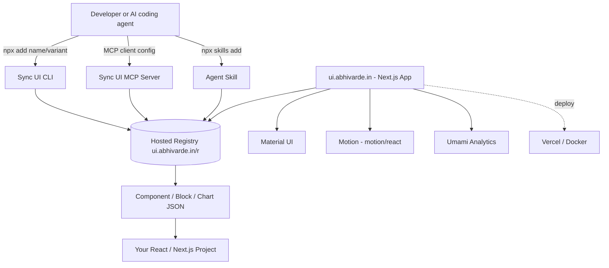

[](https://vercel.com/open-source-program)

Components, blocks, and charts built with MUI and Motion. Copy the code, install with a CLI, or connect via MCP and agent skills. Built for React, ready for your coding agent.

[](https://github.com/AbhiVarde/syncui/stargazers) [](https://github.com/AbhiVarde/syncui/blob/main/LICENSE.md) [](https://x.com/syncuidesign) [](https://vercel.com/oss)

[Website](https://ui.abhivarde.in) · [Docs](https://ui.abhivarde.in/docs) · [Components](https://ui.abhivarde.in/components) · [Blocks](https://ui.abhivarde.in/blocks) · [Charts](https://ui.abhivarde.in/charts) · [Templates](https://ui.abhivarde.in/templates) · [Showcase](https://ui.abhivarde.in/showcase) · [npm](https://www.npmjs.com/package/@abhivarde/syncui)

## CLI

Add any component, block, or chart directly into your project:

```
npx @abhivarde/syncui@latest add name/variant
```

Use `name/variant` to target exactly what you need, for example `accordion/brutalist`, `hero/centered`, or `line/dashed`.

## MCP

Let your AI agent add components, blocks, and charts directly, no commands needed:

```
{
  "mcpServers": {
    "syncui": {
      "command": "npx",
      "args": ["-y", "@abhivarde/syncui-mcp"]
    }
  }
}
```

Add to your MCP client config (Claude Code, Cursor, Windsurf, Codex, OpenCode).

## Registry

Components, blocks, and charts are served from a hosted registry. Fetch any entry directly:

```
https://ui.abhivarde.in/r/index.json
https://ui.abhivarde.in/r/{name}.json
```

This is what the CLI and MCP use under the hood. New entries go live the moment the site deploys, no package update needed.

## Agent Skill

Use Sync UI inside Cursor, Claude Code, Copilot, Windsurf, and more:

```
npx skills add AbhiVarde/syncui
```

Your AI coding tool will know every component, variant, and animation pattern without you explaining anything.

## Architecture

How the CLI, MCP server, Agent Skill, and hosted registry fit together:


```mermaid
flowchart TD
  Dev[Developer or AI coding agent] -->|npx add name/variant| CLI[Sync UI CLI]
  Dev -->|MCP client config| MCP[Sync UI MCP Server]
  Dev -->|npx skills add| Skill[Agent Skill]

  CLI --> Registry[(Hosted Registry ui.abhivarde.in/r)]
  MCP --> Registry
  Skill --> Registry

  Registry --> JSON[Component / Block / Chart JSON]
  JSON --> Project[Your React / Next.js Project]

  Site[ui.abhivarde.in - Next.js App] --> Registry
  Site --> MUI[Material UI]
  Site --> Motion[Motion - motion/react]
  Site --> Analytics[Umami Analytics]
  Site -. deploy .-> Deploy[Vercel / Docker]
```

The CLI, MCP server, and Agent Skill are all thin clients over the same hosted registry — whichever route a developer or agent uses, they resolve to the same JSON definitions, so new entries go live everywhere the moment the site deploys.

## What's Inside

| Count                 | Includes                                                                                                             |
| --------------------- | -------------------------------------------------------------------------------------------------------------------- |
| **125+ Components**   | Buttons, Cards, Tables, Forms, Date Pickers, Loaders, Avatars, Accordions, Carousels, Dialogs, Docks, Tabs, and more |
| **13+ Blocks**        | Hero, CTA, Pricing, and Stats sections for landing pages                                                             |
| **12 Chart Variants** | Bar, Donut, Heatmap, Line, Progress, and Stat, two variants each, animated and MUI styled                            |
| **3 Templates**       | Startup ($29), SaaS ($29), Portfolio ($29), Bundle, all three for $79                                                |
| **Agent Skill**       | Full component and block reference for Cursor, Claude Code, Copilot, Windsurf                                        |

## Tech Stack

| Category  | Technology            |
| --------- | --------------------- |
| Framework | React, Next.js        |
| Styling   | Material UI (MUI)     |
| Animation | Motion (motion/react) |
| Analytics | Umami                 |
| Deploy    | Vercel, Docker        |

## Getting Started

```
git clone https://github.com/AbhiVarde/syncui
cd syncui
npm install
npm run dev
```

**Docker**

```
docker build -t syncui .
docker run -p 3000:3000 syncui
```

Open <http://localhost:3000>.

## Contributing

Contributions are welcome.

1. Fork the repository
2. Create a feature branch (`git checkout -b feature/your-feature`)
3. Commit your changes (`git commit -m 'feat: add your feature'`)
4. Push to the branch (`git push origin feature/your-feature`)
5. Open a Pull Request

Follow the existing code style, test across screen sizes, and ensure accessibility standards are met. Read the full [Contributing Guide](https://github.com/AbhiVarde/syncui/blob/main/CONTRIBUTING.md).

## Support

If Sync UI is useful to you, consider supporting the project.

[Buy Me a Coffee](https://buymeacoffee.com/abhivarde9h) · [Sponsor on GitHub](https://github.com/sponsors/AbhiVarde)

Sponsor tiers: $5/month for README recognition, $19/month for README and portfolio recognition, $49/month for README, portfolio, and promotion on Sync UI.

## License

MIT. See [LICENSE](https://github.com/AbhiVarde/syncui/blob/main/LICENSE.md) for details.

## Author

Built and maintained by [Abhi Varde](https://www.abhivarde.in).

[X](https://x.com/varde_abhi) · [GitHub](https://github.com/AbhiVarde)
